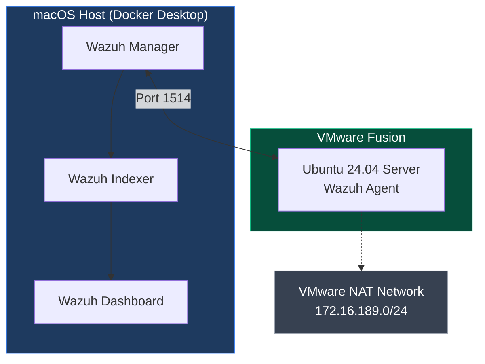

# Endpoint Detection Lab – Wazuh SIEM

## Lab Architecture



A hands-on SIEM and endpoint detection lab built to develop and demonstrate practical detection engineering skills.

## Overview

This lab uses Wazuh (open-source XDR/SIEM) running in Docker on macOS, with an Ubuntu Server virtual machine as a monitored endpoint.

**Goals of this project:**
- Deploy and operate a real SIEM
- Enroll and monitor an endpoint agent
- Generate realistic security events
- Write and test custom detection rules
- Map detections to MITRE ATT&CK
- Practice investigation and documentation

## Lab Architecture

- **SIEM**: Wazuh 4.14.6 (Manager + Indexer + Dashboard) via Docker Compose
- **Endpoint**: Ubuntu 24.04 Server (VMware Fusion)
- **Host**: macOS (Intel) with resource-constrained Docker Desktop
- **Networking**: VMware NAT (agent communicates via host IP)

## Skills Demonstrated

- SIEM deployment and configuration
- Agent enrollment and troubleshooting
- Custom detection rule creation
- MITRE ATT&CK mapping
- File Integrity Monitoring (FIM)
- Authentication failure / brute-force detection
- Log analysis and alert triage
- Secure lab design and documentation

## Custom Detections Created

| Rule ID  | Description                                      | MITRE ATT&CK | Level |
|----------|--------------------------------------------------|--------------|-------|
| 100100   | Multiple failed SSH login attempts - possible brute force | T1110       | 12    |
| 100101   | Sensitive file change detected under /etc        | T1565.001    | 10    |

## How to Run the Lab

```bash
cd wazuh-docker/single-node
docker compose up -d
```

## Security Notes

- Self-signed certificates used (acceptable for lab use only)
- Default credentials were changed
- Docker resources limited to 4.5 GB RAM and 2 CPUs because of 8 GB host machine
- Agent communicates over VMware NAT network
- Syscheck frequency was temporarily reduced for faster lab testing

## Next Steps / Future Improvements

- Add auditd for better process execution visibility
- Create more targeted custom rules (dangerous sudo commands, reverse shells, etc.)
- Add a second agent (Windows or another Linux)
- Build simple custom dashboards
- Write full investigation reports with timelines
- Implement basic active response
- Document vulnerability findings and basic remediation
